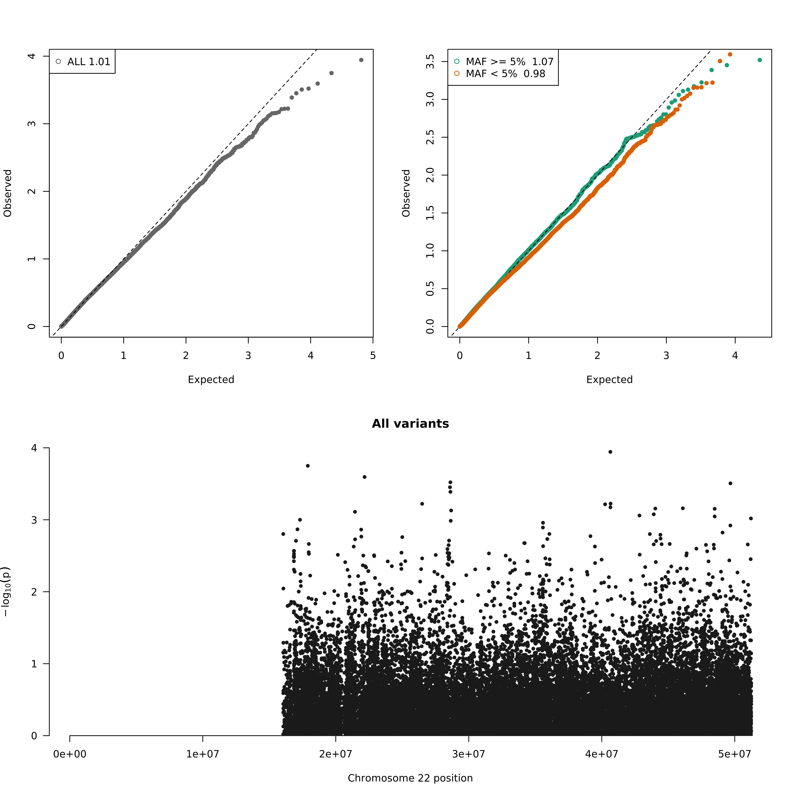

# Single Variant Association -- linear/logistic/firth

## Description 

This workflow implements a single variant association analysis of genotype data with a single trait using linear/logistic/firth. The primary code is written in R using the SeqVarTools package for association testing.

### Authors

This workflow is produced and maintained by the [Manning Lab](https://manning-lab.github.io/). Contributing authors include:

* Tim Majarian

## Dependencies

### Workflow execution

* [WDL](https://software.broadinstitute.org/wdl/documentation/quickstart)
* [Cromwell](http://cromwell.readthedocs.io/en/develop/)

### R packages

* [Biobase](https://www.bioconductor.org/packages/release/bioc/html/Biobase.html)
* [SeqVarTools](https://www.bioconductor.org/packages/release/bioc/html/SeqVarTools.html)
* [dplyr](http://dplyr.tidyverse.org/)
* [tidyr](https://tidyr.tidyverse.org/)
* [data.table](https://cran.r-project.org/web/packages/data.table/index.html)
* [qqman](https://cran.r-project.org/web/packages/qqman/index.html)

## Workflow elements

### association_glm.R

This function performs an association test to generate p-values for each variant included.

Inputs:
* gds.file : a genotype file containing data for all samples are variants to be tested (.gds)
* phenotype_file : tsv or csv of phenotypes for samples contained in the gds.file (.csv, .tsv)
* outcome_name : outcome to be tested (string)
* covariate_string : comma separated list of covariates to include in the model (string)
* id_col : column name in phenotype file with sample ids (string)
* label : prefix for output filename (string)
* test : statistical test (linear, logistic, firth)
* sample_file : text file with one sample id per line to include in analysis (optional, .txt)
* mac : minimum minor allele count for variants to be included in analysis (int, default = 5)
* variant_range : comma separated list of variant ranges in format chr#:pos_start-pos_end

Outputs:
assoc : an RData file of associations results (.RData)

### summary.R

Generate a summary of association results including quantile-quantile and manhattan plots for variants subseted by minor allele frequency (all variants, maf < 5%, maf >= 5%). Also generates CSV files of all variants and variants with P < pval_threshold.

Inputs:
* pval_threshold : p-value threshold for the returning top associations, top association output will include only variants with a p-value less than the threshold (float, default = 0.0001)
* label : prefix for output filename (string)
* assoc : output of assocTest (Array[.RData])

### Other workflow inputs

* this_memory : amount of memory in GB for each execution of a task (int)
* this_disk : amount of disk space in GB to allot for each execution of a task (int)

## Workflow Outputs

The main outputs of the single variant association workflow come from *summary.R*. Two CSV files are produced:

- All association results - analysis results for every variant tested
- Top association results - analysis results for only those variants passing a pvalue threshold

Each of these files have a single row for each variant included (multi-allelics are split with a single row per alternate allele). Each file has a minimum set of columns with a few extra columns that depend on the type of association test performed. The columns that are always present in both output CSV files are:

```
1. MarkerName: a unique identifier of the variant with the format: `chromosome-position-reference_allele-alternate_allele`, ex: `chr1-123456-A-C` (string)
2. chr: chromosome of the variant (string)
3. pos: position of the variant (int)
4. ref: reference allele of the variant as encoded in the input GDS file (string)
5. alt: alternate allele of the variant as encoded in the input GDS file (string)
6. minor.allele: allele with lowest MAF, allele tested in association analysis, relevant if a direction of effect is to be considered (string: either `alt` or `ref`)
7. maf: frequency of `minor.allele` in sample tested for association (float)
8. pvalue: pvalue generated in association analysis (float)
9. n: number of samples used in generated association statistics (int)
```

If the trait of interest is dichotomous:

```
10. homref.case: number of homozygous reference cases (int)
11. homref.control: number of homozygous reference controls (int)
12. het.case: number of heterozygous reference cases (int)
13. het.control: number of heterozygous reference controls (int)
14. homalt.case: number of homozygous alternate cases (int)
15. homalt.control: number of homozygous alternate controls (int)
```

If the statistical test is the Score test:

```
16. Score.stat: score statistic of the variant (float)
```

If the statistical test is the Wald test:

```
9. Wald.Stat: Wald statistic of the variant (float)
```

Below is an example output file using 1000 genomes data and simulated phenotypes. Note that case/control genotype counts is only calculated for variants with minor allele frequency < 5% __and__ pvalue < 0.01. (maf, pvalue, and Score.Stat have been truncated for display only)

| MarkerName | chr | pos | ref | alt | minor.allele | maf | pvalue | n | or | homref.case | homref.control | het.case | het.control | homalt.case | homalt.control | 
| --- | --- | --- | --- | --- | --- | --- | --- | --- | --- | --- | --- | --- | --- | --- | --- |
| 22-16911246-C-2 | 22 | 16911246 | C | 2 | alt | 0.022963259 | 0.005272838 | 2504 | 2.491866447 | 485 | 1909 | 11 | 94 | 0 | 5 | 
| 22-16913263-G-2 | 22 | 16913263 | G | 2 | alt | 0.053115016 | 0.295505827 | 2504 | 1.202738601 |  |  |  |  |  | | 
| 22-17008575-C-2 | 22 | 17008575 | C | 2 | alt | 0.063298722 | 0.898198073 | 2504 | 1.020014302 |  |  |  |  |  | | 
| 22-17008980-C-2 | 22 | 17008980 | C | 2 | alt | 0.065894569 | 0.761055316 | 2504 | 1.047914855 |  |  |  |  |  | | 
| 22-17009923-G-2 | 22 | 17009923 | G | 2 | alt | 0.011980831 | 0.001961774 | 2504 | 0.414552032 | 475 | 1969 | 21 | 39 | 0 | 0 | 
| 22-17010327-T-2 | 22 | 17010327 | T | 2 | alt | 0.004193291 | 0.224388837 | 2504 | 2.494139403 |  |  |  |  |  | | 
| 22-17010636-C-2 | 22 | 17010636 | C | 2 | alt | 0.00399361 | 0.216093467 | 2504 | 0.537471883 |  |  |  |  |  | | 


*summary.R* also produces a PNG file with Manhattan and quantile-quantile plots. Three plots are shown in this image (from top-left):

1. QQ plot of all variants
2. QQ plot of variants divided into *Common variants* with MAF >= 5% and *Low frequency and rare variants* with MAF < 5%. Genomic control is shown at top left of each plot.
3. Manhattan plot of all variants with nominal (1e-5) and genomewide (5e-8) significance thresholds in blue and red lines respectively.




